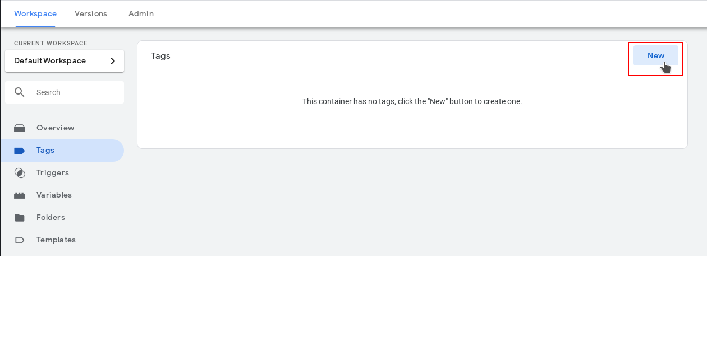
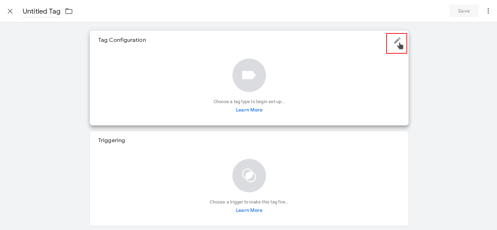
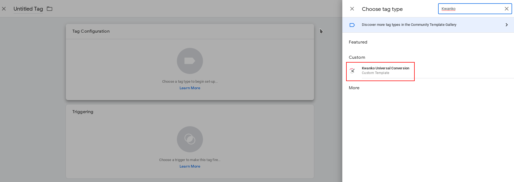
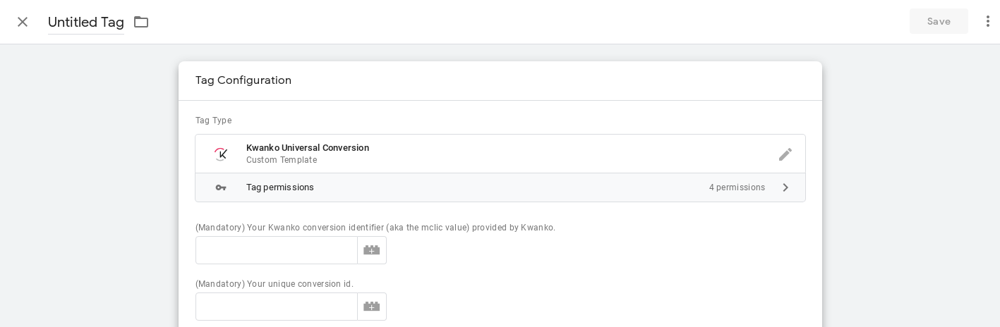
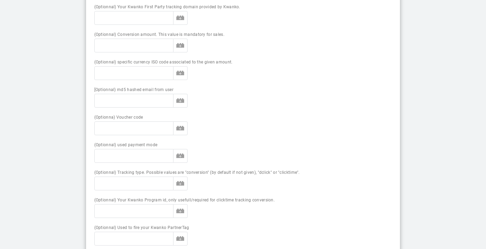
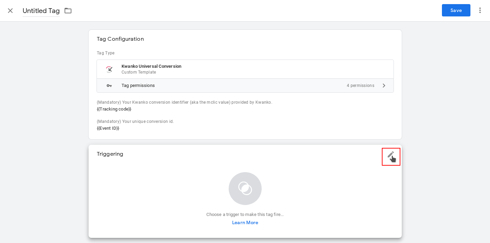

# Kwanko Universal Conversion Tag for GTM setup guide

## Introduction

### What is it for ?

This tag will give you the opportunity to fire any tracking objective type handled by Kwanko (ex: lead, sale, double click, clicktime) through your own dataLayer variables, without the need of installing any other specific Kwanko tracking pixel on your website.

### What does it do ?

It does trigger the conversion in the Kwanko tracking system using our latest tracking features like uniJS and first party.

### Recommendation

For optimal tracking results, we recommend you first to install our uniJS library on your website (please contact our technical support team if you have any related questions). If you've not, please consider installing our Kwanko GTM default tag to make you compliant with our third party cookieless tracking feature.

## Setup steps

In this documentation, you'll find the detailed steps to easily setup the Kwanko Universal Conversion Tag through GTM.

### Create a new tag

The first step is to create a new Tag in your GTM workspace :

### Tag configuration

Then you will have to configure your tag :

And searching for the Kwanko universal conversion template :

### Kwanko variables setup

They are some mandatory and optionnal options you'll have to setup to make the tag work. Some are mandatory and some others optionnal.

At this point, you can choose between :
1. fill directly the plain text value for a variable (for the values you know in advance, like the Kwanko conversion identifier or your dedicated Kwanko first party tracking domain)
2. match the variable with you own datalayer variable you've defined in your container

The second option looks like the most flexible for almost all options excepting for fixed values like for example you Kwanko custom first party tracking domain.
It allows you for example to re-use your tag for multiple tag conversion type (different Kwanko conversion identifier values).

Please refer to the full variable list description below to be sure to provide us the appropriate value.

| Name | Type | Mandatory | Description |
|---|---|---|---|
| Conversion identifier | string | yes | This value is provided by Kwanko |
| Unique conversion id | string | yes | It's your unique conversion identifier for each conversion (example: the order ID or booking ID or subscription ID) |
| First party tracking domain | string |  no | Provided by Kwanko if First Party Tracking is activated on your campaign |
| Conversion amount | numeric |  no | The amount associated to the triggered conversion. This value is expected for sales conversion. This amout must **excluding taxes and shipping costs**. Please, **do not include currency symbol and don't use thousands separators. Only dot (.) or comma (,) are recognized as decimal separator.** |
| Currency ISO code | string | no | The [ISO 4217](https://en.wikipedia.org/wiki/ISO_4217) (3 characters) code reprensenting the currency associated to the transaction (ex: EUR, USD, GPB). Can be ignored if the currency always matches with the default currency of your campaign. |
| User MD5 hashed email | string | no | MD5 hashed email address of the visitor for cross device compatibility. If you provide the email address not encrypted, the tracking server will automatically encrypt it as MD5 and the email address itself will not be stored in our server anyway. |
| Voucher code | string |  no | Value of the VoucherTag code related to the current conversion (if any). |
| User payment mode | string | no | The name of the payment type if you wan't this information to be displayed in our platform. Please **use explicit names with alphanumeric characters and without space or special characters and no accent.** (ex: "paypal", "creditcard", "moneytransfer", "cheque", etc.) |
| Tracking event type | string | no | The name of the tracking event type among : "conversion" (default one) for a lead or sale, "dclick" for DoubleClick tags, "clicktime" for ClickTime tags. Please refer to the information provided by Kwanko associated to each of your conversion identifiers to provide the good one. |
| Program ID | integer | no | You Program ID provided by Kwanko. This value is only usefull/mandatory for "ClickTime" tag event type. |
| Ptag flag | integer | no | Use "1" if your Kwanko PartnerTag associated to your Campaign should be fired in the current transaction context, "0" or don't use this option if you've already implemented Kwanko PartnerTag url or do not want to fire it in your triggering context. |

### Choose your custom trigger

Don't forget to choose your custom trigger rule for the conversion :

### Save, submit and publish your container

And that's it !
Congratulations, your tag is ready to be used.
